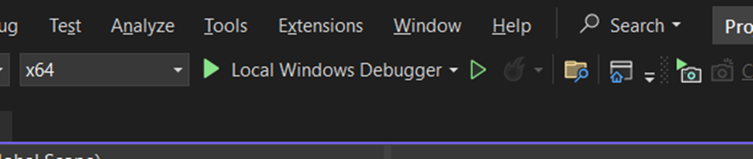

# ProjectKTLT-23CLC03-StudentManagingSystem-Group12
B1: Run chương trình (ctrl F5)

-	Sau khi run chương trình sẽ thông báo:

B2: Thực hiện lần lược vào các thư mục : …ProjectKTLT-> SFML -> bin . Sau đó sao chép tất cả các file có trong thư mục đó

-	Trở lại thư mục …ProjectKTLT - >x64 - >Debug . Và paste tất cả các file đã sao chép vào thư mục này:

B3: Thực hiện chạy lại chương trình một lần nữa. Như vậy đã chạy được chương trình.
